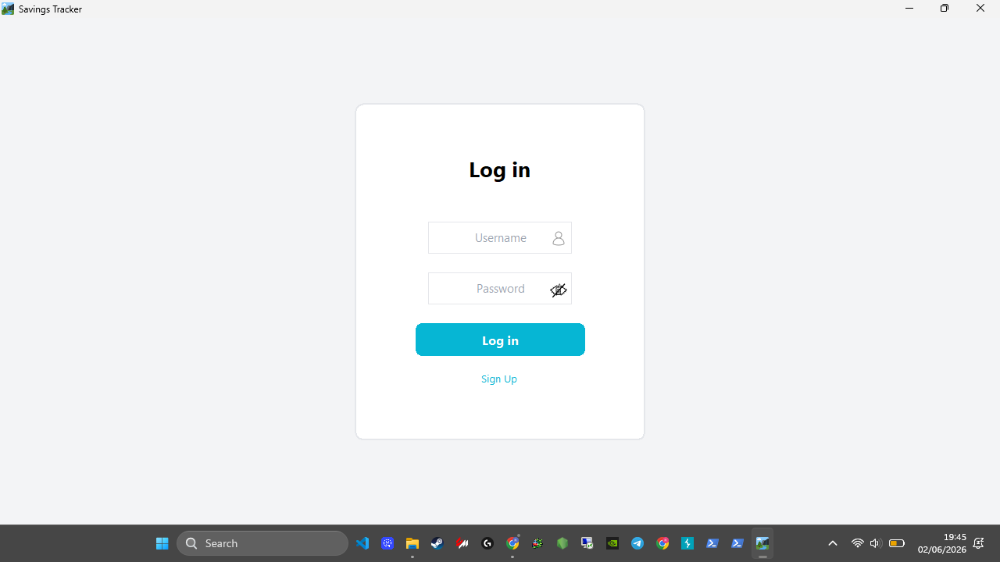
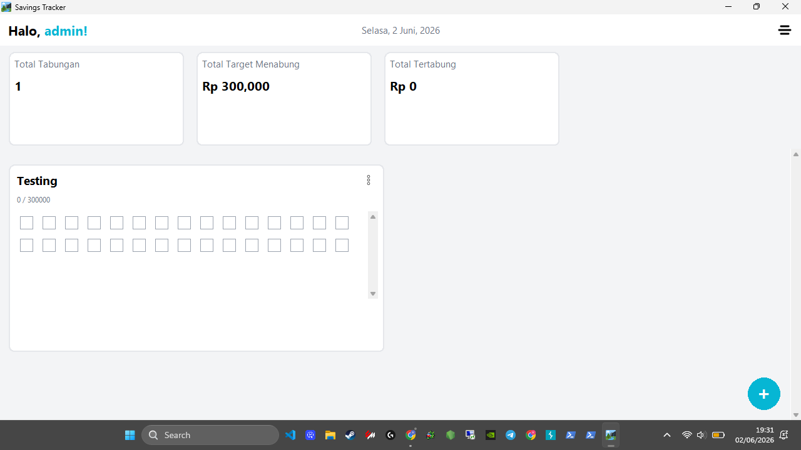
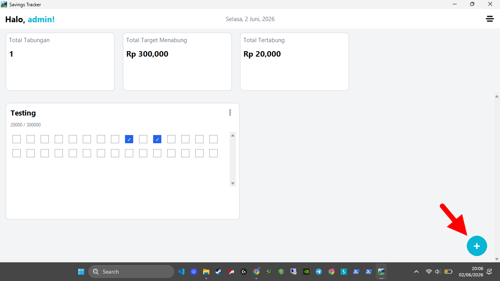
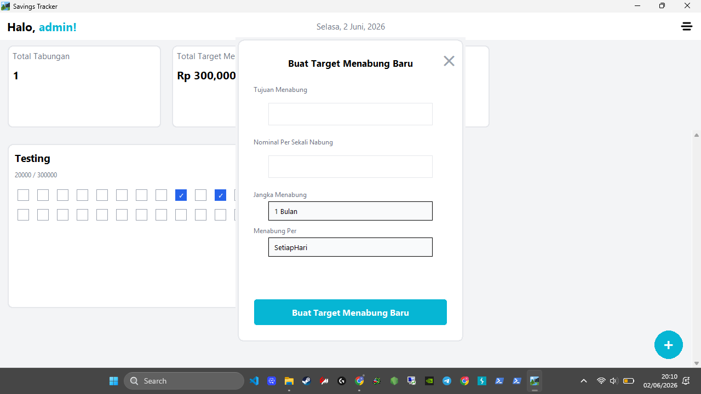
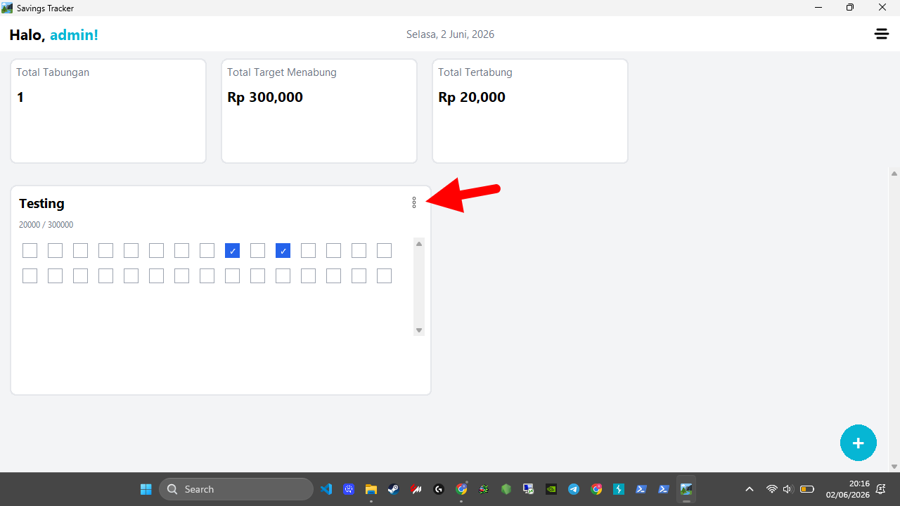
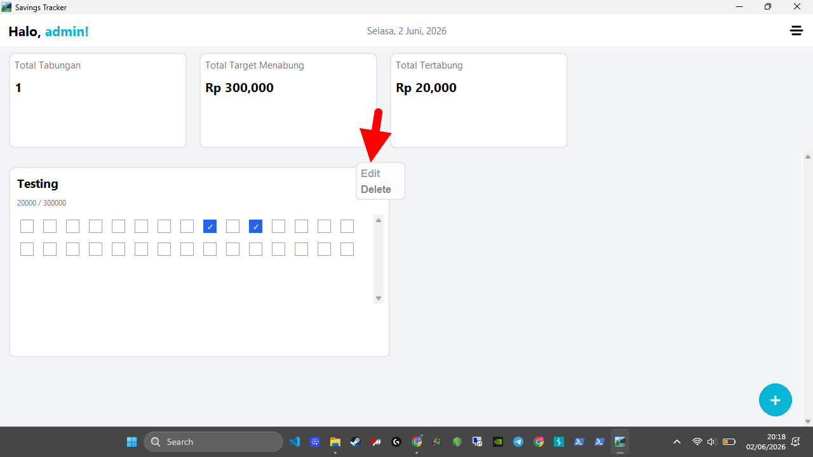
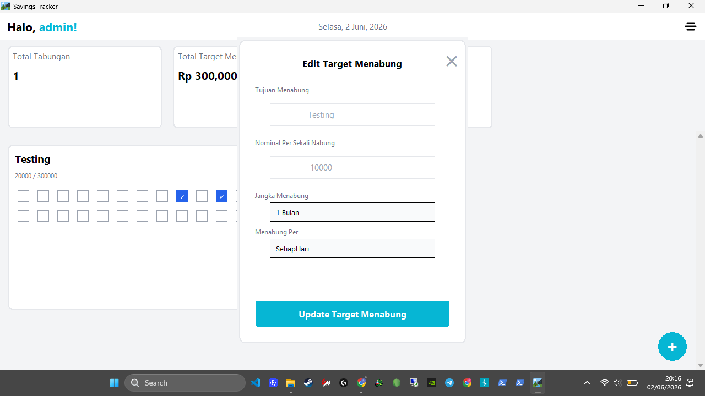
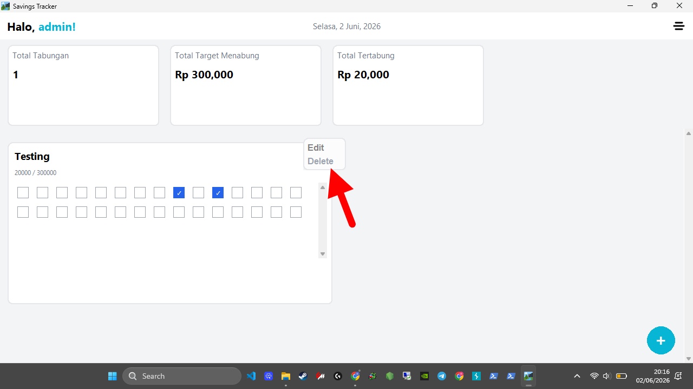
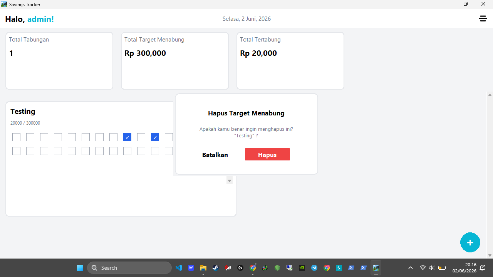
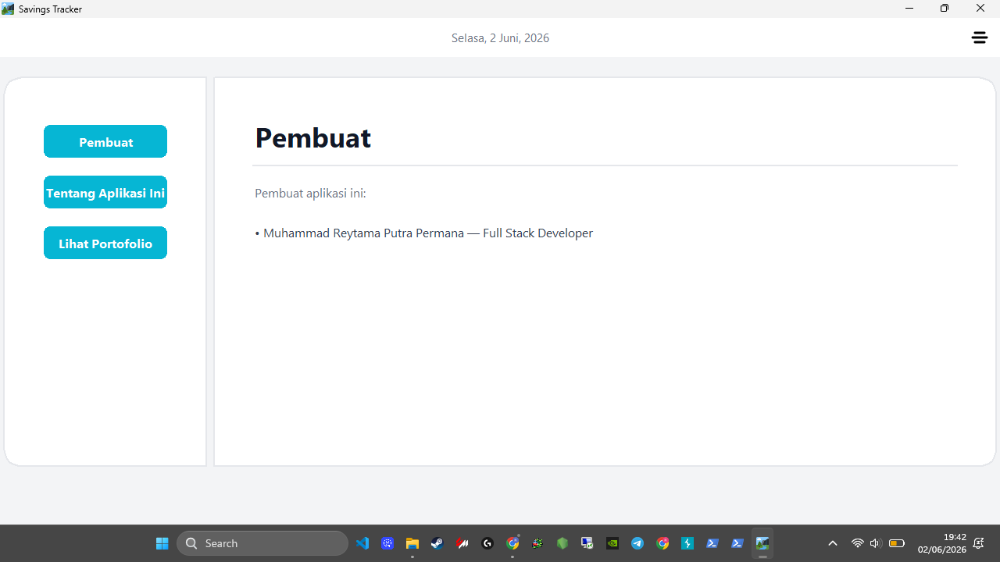

## Tutorial Penggunaan Aplikasi Savings Tracker

Ikuti langkah-langkah di bawah ini untuk bisa menggunakan aplikasi Savings Tracker:

### 1. Pendaftaran & Autentikasi Pengguna
Sebelum mengelola keuangan, pengguna diwajibkan membuat akun terlebih dahulu demi keamanan data.
<table>
  <tr>
    <td width="50%">
      
    </td>
    <td width="50%">
      <h4>Langkah 1: Registrasi Akun baru</h4>
      <ul>
        <li>Jalankan/buka aplikasi yang bernama "Savings Tracker.exe" atau "Savings Tracker".</li>
        <li>Klik tombol "Sign Up" untuk membuat akun baru.</li>
        <li>Isi data Username, dan buat kata sandi yang aman.</li>
      </ul>
    </td>
  </tr>
  <tr>
    <td width="50%">
      
    </td>
    <td width="50%">
      <h4>Langkah 2: Masuk ke Sistem</h4>
      <ul>
        <li>Klik tombol "Log in" untuk masuk ke akun yang sudah dibuat.</li>
        <li>Masukkan email dan kata sandi yang telah didaftarkan.</li>
        <li>Klik tombol "<b>Log in</b>" untuk masuk ke dalam halaman Beranda atau "Dashboard".</li>
      </ul>
    </td>
  </tr>
</table>

---

### 2. Memantau Beranda(Dashboard) & Target Tabungan
Setelah kalian masuk ke akun yang sudah dibuat, kamu akan langsung diarahkan ke halaman beranda untuk melihat status tabungan saat ini.
<table>
  <tr>
    <td width="50%">
      
    </td>
    <td width="50%">
      <h4>Fitur Utama Dashboard:</h4>
      <ul>
        <li><b>Total Tabungan:</b> Melihat ada berapa target menabung yang telah dibuat yang dirender secara dinamis.</li>
        <li><b>Total Target Menabung:</b> Visualisasi target tabungan secara keseluruhan yang dirender secara dinamis.</li>
        <li><b>Total Tertabung:</b> Melihat akumulasi saldo yang berhasil dikumpulkan secara keseluruhan yang dirender secara dinamis.</li>
      </ul>
    </td>
  </tr>
</table>

---

### 3. Mencoba membuat target menabung & mengedit + menghapusnya
Agar kalian dapat membuat target menabung baru, maka kalian haruslah berada di halaman beranda terlebih dahulu
dengan mengklik ikon pojok kanan atas, lalu klik teks bertuliskan "Beranda".
<table>
  <tr>
    <td width="50%">
      
    </td>
    <td width="50%">
      <h4>Langkah 1: Membuat Target Menabung Baru</h4>
      <ul>
        <li>Kliklah tombol berikon Plus di pojok kanan bawah.</li>
      </ul>
    </td>
  </tr>
  <tr>
    <td width="50%">
      
    </td>
    <td width="50%">
      <h4>Langkah 2: Mengisi kolom-kolom yang ada dan memilih pilihan yang tersedia dari kolom dropdown</h4>
      <ul>
        <li>Isilah kolom "Tujuan Menabung", dan kolom "Nominal Per Sekali Nabung".</li>
        <li>Klik kolom dropdown yang bernama "Jangka Menabung", lalu pilih dari salah satu pilihan yang tersedia menyesuaikan keinginan kalian.</li>
        <li>Klik kolom dropdown yang bernama "Menabung Per", lalu pilih dari salah satu pilihan yang tersedia menyesuaikan keinginan kalian.</li>
        <li>Terakhir klik tombol "Buat Target Menabung Baru"</li>
      </ul>
    </td>
  </tr>
  <tr>
    <td width="50%">
      
    </td>
    <td width="50%">
      <h4>Langkah 3(Opsional): Mencari Tombol More atau Tombol berikon Titik Tiga</h4>
      <ul>
       <li>Kliklah tombol berikon Titik Tiga di pojok kanan atas dalam box target menabung yang kalian inginkan.</li>
      </ul>
    </td>
  </tr>
  <tr>
    <td width="50%">
      
    </td>
    <td width="50%">
      <h4>Langkah 4(Wajib Jika Mau dan Telah Mengikuti Langkah ke 3): Mengedit Target Tabungan</h4>
      <ul>
        <li>Kliklah teks bertuliskan "Edit" di atas teks bertuliskan "Delete" dalam menu dropdown Titik Tiga.</li>
      </ul>
    </td>
  </tr>
  <tr>
    <td width="50%">
      
    </td>
    <td width="50%">
      <h4>Langkah 5(Wajib Jika Mau dan Telah Mengikuti Langkah ke 4): Mengisi kolom-kolom yang ada dan memilih pilihan yang tersedia dari kolom dropdown</h4>
      <ul>
        <li>Isilah kolom "Tujuan Menabung", dan kolom "Nominal Per Sekali Nabung".</li>
        <li>Klik kolom dropdown yang bernama "Jangka Menabung", lalu pilih dari salah satu pilihan yang tersedia menyesuaikan keinginan kalian.</li>
        <li>Klik kolom dropdown yang bernama "Menabung Per", lalu pilih dari salah satu pilihan yang tersedia menyesuaikan keinginan kalian.</li>
        <li>Terakhir klik tombol "Update Target Menabung"</li>
      </ul>
    </td>
  </tr>
  <tr>
    <td width="50%">
      
    </td>
    <td width="50%">
      <h4>Langkah 6(Wajib Jika Mau dan Telah Mengikuti Langkah ke 3): Menghapus Target Tabungan</h4>
      <ul>
        <li>Kliklah teks bertuliskan "Delete" di bawah teks bertuliskan "Edit" dalam menu dropdown Titik Tiga.</li>
      </ul>
    </td>
  </tr>
  <tr>
    <td width="50%">
      
    </td>
    <td width="50%">
      <h4>Langkah 7(Wajib Jika Mau dan Telah Mengikuti Langkah ke 6): Menetukan Apakah kita Benar Ingin Menghapusnya</h4>
      <ul>
        <li>Jika kalian tidak menginginkannya, maka kliklah tombol yang bernama "Batalkan".</li>
        <li>Jika kalian menginginkannya, maka kliklah tombol yang bernama "Hapus".</li>
      </ul>
    </td>
  </tr>
</table>

---

### Detail Informasi Aplikasi

<b>Klik di sini untuk melihat informasi tambahan mengenai sistem pengembang (About)</b>

Di dalam halaman ini(kalian dapat mengakses halaman ini dengan mengklik ikon pojok kanan atas, lalu klik teks bertuliskan "About"),
kalian dapat melihat informasi mengenai penjelasan aplikasi ini, siapa pembuat aplikasi ini, serta portofolio pengembang di balik pembuatan aplikasi **Savings Tracker**.

